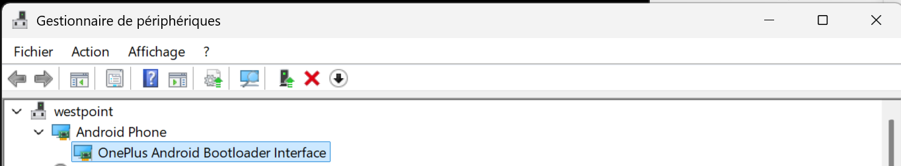

# android-forensics

# Pre-req

Get some [Markdown knowledge](https://learn.microsoft.com/en-us/contribute/content/markdown-reference)

You may need to download  [universal adb drivers](https://www.google.com/search?q=universal+adb+drivers&oq=universal+adb+drivers+&aqs=chrome..69i57j0i512l5.5345j0j4&client=ms-android-hms-tmobile-us&sourceid=chrome-mobile&ie=UTF) or [https://github.com/fawazahmed0/Latest-adb-fastboot-installer-for-windows](https://github.com/fawazahmed0/Latest-adb-fastboot-installer-for-windows)

<span style="color:red">**/!\ IMPORTANT WARNING: **</span>
Based on [reddit article](https://www.reddit.com/r/lgv30/comments/rea1tt/device_not_detected_by_both_adb_and_fastboot_in/) it looks like  AMD Ryzen is NOT supported, your Android device driver will not been found in Windows Device Manager after you run 'adb reboot bootloader'

See :
- [XDA Forum about AMD Ryzen](https://xdaforums.com/t/fix-fastboot-issues-on-ryzen-based-pcs.4186321/#post-85979497)
- [AMD Ryzen Hotfix](https://xdaforums.com/attachments/amd-ryzen-usb-controller-fix-zip.5464451/)

The above hotfix contains:
```bash
@echo off
reg add "HKEY_LOCAL_MACHINE\SYSTEM\CurrentControlSet\Control\usbflags\18D1D00D0100" /v "osvc" /t REG_BINARY /d "0000" /f
reg add "HKEY_LOCAL_MACHINE\SYSTEM\CurrentControlSet\Control\usbflags\18D1D00D0100" /v "SkipContainerIdQuery" /t REG_BINARY /d "01000000" /f
reg add "HKEY_LOCAL_MACHINE\SYSTEM\CurrentControlSet\Control\usbflags\18D1D00D0100" /v "SkipBOSDescriptorQuery" /t REG_BINARY /d "01000000" /f

pause
```

Once all three commands are executed, reboot your PC. The issue should now be fixed.

## SetUp Hyper-V and WSL2 on Windows

If you need to Setup Hyper-V + WSL2 with Ubuntu 24.04 on Windows 11, you can read [https://github.com/ezYakaEagle442/sec102?tab=readme-ov-file#pre-req](https://github.com/ezYakaEagle442/sec102?tab=readme-ov-file#pre-req)

## Install Docker

Read :
- [https://docs.docker.com/engine/install/ubuntu/](https://docs.docker.com/engine/install/ubuntu/)
- [https://docs.docker.com/engine/install/ubuntu/#install-using-the-convenience-script](https://docs.docker.com/engine/install/ubuntu/#install-using-the-convenience-script) 

```bash
curl -fsSL https://get.docker.com -o get-docker.sh
sudo sh get-docker.sh

# check docker version
docker -v

sudo groupadd docker
sudo usermod -aG docker $USER
```

## Download the latest Microsoft Visual C++ Redistributable Version

Read [https://learn.microsoft.com/en-us/cpp/windows/latest-supported-vc-redist?view=msvc-170#latest-microsoft-visual-c-redistributable-version](https://learn.microsoft.com/en-us/cpp/windows/latest-supported-vc-redist?view=msvc-170#latest-microsoft-visual-c-redistributable-version)

[https://aka.ms/vs/17/release/vc_redist.x64.exe](https://aka.ms/vs/17/release/vc_redist.x64.exe)


## Rebuild Linux kernel in WSL2

- To mount USB Drives : [https://learn.microsoft.com/en-us/windows/wsl/connect-usb](https://learn.microsoft.com/en-us/windows/wsl/connect-usb)
- See also how to [rebuild Linux kernel in WSL2](https://github.com/ezYakaEagle442/secure-wipe)


## Install Google USB Driver

Download:
- [https://developer.android.com/studio/run/win-usb](https://developer.android.com/studio/run/win-usb)
- [https://dl.google.com/android/repository/usb_driver_r13-windows.zip](https://dl.google.com/android/repository/usb_driver_r13-windows.zip)
- [https://dl.google.com/android/repository/latest_usb_driver_windows.zip](https://dl.google.com/android/repository/latest_usb_driver_windows.zip)

This provide the drivers of a LIMITED subset of devices, including Google Nexus, see the list at usb_driver\android_winusb.inf


## Get the OEM USB Drivers

Once you have plugged your device to your laptop USB port, you'll be able to see a folder in your Windows File Explorer: "CD Drive (drive_letter , exx 'D') OnePlus Drivers" and you can see:
- adb_config_Linux_OSX.sh
- AndroidFileTransfer.dmg
- autorun.inf
- OnePlus_setup.exe
- OnePlus_USB_Drivers_Setup.exe

- [https://developer.android.com/studio/run/oem-usb#Drivers](https://developer.android.com/studio/run/oem-usb#Drivers)
- [https://androidmtk.com/download-oneplus-usb-driver](https://androidmtk.com/download-oneplus-usb-driver)

If you don't see a link for the manufacturer of your device here, go to the support section of the manufacturer's website and search for USB driver downloads for your device. Ex:
- [https://oneplususbdrivers.com/](https://oneplususbdrivers.com/)

Run OnePlus_setup.exe. Drivers should be installed at:
- C:\Android\.android
- C:\Program Files (x86)\OnePlus USB Drivers
- C:\Windows\System32\drivers\winusb.sys
- C:\Windows\System32\drivers\WpdUpFltr.sys
- C:\Windows\System32\drivers\WUDFRd.sys
- C:\Windows\System32\WpdMtp.dll
- C:\Windows\System32\WpdMtpUS.dll

Check Installation log files at C:\Program Files (x86)\OnePlus USB Drivers\install_log.txt

## Enbale Developer mode

Go to Settings / About the device phone / hit 7 times the Nuild Number
Then Check : go to System , go donw to 'Options for Developers'

## Install Android Debug Bridge

Read :
- [https://developer.android.com/tools/adb](https://developer.android.com/tools/adb)
- []()
- []()
- [https://www.debugpoint.com/how-to-access-android-devices-internal-storage-and-sd-card-in-ubuntu-linux-mint-using-media-transfer-protocol-mtp/](https://www.debugpoint.com/how-to-access-android-devices-internal-storage-and-sd-card-in-ubuntu-linux-mint-using-media-transfer-protocol-mtp/)
- [https://www.frandroid.com/android/rom-custom-2/403222_comment-telecharger-les-outils-adb-et-fastboot-sur-windows-macos-et-linux](https://www.frandroid.com/android/rom-custom-2/403222_comment-telecharger-les-outils-adb-et-fastboot-sur-windows-macos-et-linux)

```bash
lsb_release -a
hostnamectl

sudo apt update && apt upgrade -y

sudo apt-get install android-tools-adb --yes
sudo apt-get install android-tools-fastboot --yes
sudo apt-get install fastboot --yes

# https://packages.ubuntu.com/search?suite=noble&section=all&arch=any&keywords=libmtp&searchon=names
sudo apt-get install go-mtpfs --yes
sudo apt-get install libmtp-common libmtp-dev libmtp-doc libmtp-runtime libmtp9t64 --yes
sudo apt-get install jmtpfs mtp-tools --yes

mtp-detect
sudo jmtpfs -l
adb devices

ls -al /etc/udev/rules.d/
```

At this stage, if you do not see your Android device on WSL2, check it is correctly mount on Windows.
You can check running Windows Devcie Manager / you should see your phone under "Mobile devices"

```bash
USB_IPD_WIN_VERSION=4.4.0
USB_IPD_WIN_URL="https://github.com/dorssel/usbipd-win/releases/download/v$USB_IPD_WIN_VERSION/usbipd-win_$USB_IPD_WIN_VERSION.msi"
echo "Download $USB_IPD_WIN_URL and run it"

sudo apt-get install linux-tools-common --yes

# This doesn't work on Windows Subsystem for Linux because the kernel version name is non-standard (e.g. 5.15.167.4-microsoft-standard-WSL2+).
# sudo apt install linux-tools-$(uname -r) hwdata

# sudo apt-get install linux-azure-tools-6.8.0-1007 --yes
# sudo apt-get install linux-oem-6.8-tools-6.8.0-1005 --yes
# sudo apt-get install linux-tools-6.8.0-31 --yes
# sudo apt-get install linux-tools-6.8.0-1007-azure --yes
# sudo apt-get install linux-tools-6.8.0-31-generic --yes

sudo apt install linux-tools-generic hwdata --yes
# sudo apt-get install usbipd --yes
```

Run PowserShell as admin
```bash
usbipd list
$BUS_ID="7-2" # example in my case, take the right one for you
usbipd bind --busid $BUS_ID
usbipd attach --wsl --busid $BUS_ID
```

```console
Connected:
BUSID  VID:PID    DEVICE                                                        STATE
1-3    0489:e0f6  MediaTek Bluetooth Adapter                                    Not shared
1-4    0b05:19b6  Périphérique d’entrée USB                                     Not shared
1-5    0b05:193b  Périphérique d’entrée USB                                     Not shared
4-1    047f:02e9  Périphérique d’entrée USB                                     Not shared
5-1    3277:0051  USB2.0 FHD UVC WebCam, USB2.0 IR UVC WebCam, Camera DFU D...  Not shared
7-1    046d:c077  Périphérique d’entrée USB                                     Not shared
7-2    2a70:f003  ONEPLUS A6013                                                 Not shared
```

Now you can go to your wsl session and use the mounted device, mine was located at /mnt/d


Plug in your Android device using a USB cable connected to your laptop.
On your Android device, swipe down from above on the home screen and click Touch for more options.
In the following menu, select the option “Transfer File (MTP)“.

<span style="color:red">**/!\ IMPORTANT WARNING: **</span>
go to Parameters / System / Developpers options :

- enable Developpers options
- USB debugging MUST BE switched OFF

```bash
ls -l /dev/disk/by-uuid 
ls -al /mnt/d

mtp-detect
sudo jmtpfs -l
```


```bash

# https://www.debugpoint.com/how-to-access-android-devices-internal-storage-and-sd-card-in-ubuntu-linux-mint-using-media-transfer-protocol-mtp/

sudo touch /etc/udev/rules.d/51-android.rules
sudo chmod g+w /etc/udev/rules.d/51-android.rules
sudo chmod a+r /etc/udev/rules.d/51-android.rules

ls -al /etc/udev/rules.d/
sudo vim /etc/udev/rules.d/51-android.rules
```


Type the below line using your device’s VID and PID in the 51-android.rules file (which you note down in previous step). 

```bash
'SUBSYSTEM=="usb", ATTR{idVendor}=="2a70", ATTR{idProduct}=="f003", MODE="0666"' >> /etc/udev/rules.d/51-android.rules
```

```bash
sudo udevadm control --reload-rules
sudo service udev restart

sudo adb kill-server
sudo adb start-server

sudo adb usb
sudo adb tcpip 5555
```

to find your phone ip:
    Open your phone wifi-settings
    Click on Advanced
    You will see your ip. It will be something like: 192.168.x.y
    In the snippet below, replace 192.168.x.y with your actual IP address


Open the Settings app, and select System & updates -> Developer Options.
Toggle Wireless debugging to on.
Click Allow on the pop-up menu to activate debugging on the connected network.
Open the Wireless Debugging option via Settings -> System & updates -> Wireless debugging, and tap Pair device with pairing code

```bash
export ALLOW_ADBD_ROOT=1

adb get-state

# first ensure you can ping your phone, if not check the Developper settings / debug option
ping 192.168.x.y


adb pair 192.168.x.y:37109 # the port is random dyanmic
adb connect 192.168.x.y:5555

# if the above fails with failed to connect to '192.168.1.64:5555': Connection refused
# try again and rerun: adb connect 192.168.x.y:5555
# also check/uncheck the Developper settings / Wifi debug option 
# also check/uncheck the Developper settings / debug option 

sudo adb kill-server
sudo udevadm control --reload-rules
sudo service udev restart
sudo adb start-server

adb devices -l
adb version
adb get-state
adb get-serialno
# adb pull
# adb root
# adb usb

sudo fastboot devices -l -v

adb shell
uname -a
whoami
pwd

# external SD-Card
ls -al /sdcard/
ls -al /storage/emulated/0/DCIM

# internal memory
ls -al /mnt/runtime/write

exit

# if you want to get a local copy in WSL2 of your Android storage
adb pull /storage/self/primary/

# https://askubuntu.com/questions/264726/adbd-cannot-run-as-root-in-production-builds
# adb shell setprop ro.secure 0
# adb shell setprop ro.debuggable 1
# adb shell setprop persist.service.adb.enable 1
# https://github.com/Chainfire/platform_system_core
```


Enable OEM unlock in the Developer options under device Settings, if present.
```bash
adb reboot bootloader
```

Once the device is in fastboot mode, verify your PC finds it by typing: 
```bash
sudo fastboot devices -l -v
#fastboot reboot fastboot
```

If fastboot does not see your device from the above command, from Windows Device Manager , Check 'Other device' and should see Android with a 'yellow warning' to mean there is not driver installed.


From DeviceManager, Update the Andoid USB drivers using the files from C:\Program Files (x86)\OnePlus USB Drivers, you should not need the files copied as step [Get the OEM USB Drivers](#get-the-oem-usb-drivers).

If the issue is till not resolved, or you it this error message:
"__The hash for the file is not present in the specified catalog file. The file is likely corrupt or the victim of tampering__"

Read [XDA Forum](https://xdaforums.com/t/guide-fix-device-not-showing-up-in-fastboot-mode-windows-10-11.4194491/)

1. To get around this we are going to disabled signed drivers on windows

    - Select the “Start” button.
    - Type “startup”.
    - Select “Change advanced startup settings“.
    - Select “Restart now” under the “Advanced startup” area.
    - Once presented with the Advanced options select...
        “Troubleshoot“ --> “Advanced Options“ --> “Startup Options“ --> “Restart“
    - After that, a menu will appear where you can press “7” on your keyboard to choose “Disable driver signing enforcement“.
        note: if BitLocker is enabled, you will need the BitLocker key

2. Now Device Driver Signing should be disabled, allowing you to install any driver until you reboot, meaning we can install our unsigned OnePlus driver.

    - Pop open Device Manager
        You can press windows + x to bring up a menu, then you can press m or select device manager for quick access
    - Boot your device into fastboot mode.
        This should cause it to show up in device manager as "Andriod", with a yellow triangle
    - In device manager right click the "android" device
    - Then press the following options
        Update driver --> Browse my computer --> Let me pick --> Have Disk
    - Navigate to the folder from earlier: C:\Program Files (x86)\OnePlus USB Drivers and click okay
    - After that, OnePlus Android Bootloader interface should be selected. Go ahead and install it.



Then you have to go to Windows Update and browse the **optional** updates :


```bash
sudo fastboot devices -l -v 
```

You can test from DOS : 
```bash
fastboot devices -l
```

```console
C:\Android>fastboot devices -l
2770048a               fastboot
```

[See this hotfix](https://stackoverflow.com/questions/60166965/adb-device-list-empty-using-wsl2) :
```bash
printf '\n%s\n%s\n' \
'### Alias  for Android Debugging in WSL2' \
'alias adb="/mnt/c/Android/adb.exe"' \ 
 >> ~/.bashrc

source ~/.bashrc
```

If you need to uninstall the Android Driver to Fix & Kedacom USB Interface , then your Android phone will be displayed again as Android Boot Loader Interface in Windows Device Manager
https://www.youtube.com/watch?v=K1hDEBCYHSo


Now type the following command to unlock the bootloader:
```bash
sudo fastboot oem unlock
# sudo fastboot flashing unlock

```


```bash
adb shell; su;
uname -a
whoami

ls -al /system/etc
cat /system/etc/group
cat /system/etc/passwd

ls -al /vendor
ls -al /storage/emulated/0
ls -al /storage/emulated/0/Documents
ls -al /storage/emulated/0/DCIM/Camera
ls -al /storage/emulated/0/Pictures/SMS/MMS/
ls -al /data
ls -al /data/data/com.android.providers.telephony/databases
ls -al /data/data/com.android.providers.contacts/databases/

```


# Manage SMS

- [https://developer.android.com/identity/data/backup](https://developer.android.com/identity/data/backup)
- [https://developer.android.com/identity/data/autobackup#EnablingAutoBackup](https://developer.android.com/identity/data/autobackup#EnablingAutoBackup)
- [https://developer.android.com/reference/android/provider/Telephony.Sms?hl=en](https://developer.android.com/reference/android/provider/Telephony.Sms?hl=en)
- [https://forum.f-droid.org/t/copy-my-contacts-from-my-old-phone/22007](https://forum.f-droid.org/t/copy-my-contacts-from-my-old-phone/22007)
- [Query to get SMS](https://www.youtube.com/watch?v=MgUl5qoCyuc)
- [How to recover deleted sms messages from android](https://www.youtube.com/watch?v=4MUf8AvjvT0)
- [https://developer.android.com/about/versions/12/behavior-changes-12#adb-backup-restrictions](https://developer.android.com/about/versions/12/behavior-changes-12#adb-backup-restrictions)
- [https://stackoverflow.com/questions/43325303/reading-sms-from-android-device-using-adb-shell-commands](https://stackoverflow.com/questions/43325303/reading-sms-from-android-device-using-adb-shell-commands)
- [https://android.stackexchange.com/questions/114437/backup-restore-sms-mms-via-adb-on-a-non-rooted-device](https://android.stackexchange.com/questions/114437/backup-restore-sms-mms-via-adb-on-a-non-rooted-device)
- [https://github.com/nelenkov/android-backup-extractor](https://github.com/nelenkov/android-backup-extractor)


```bash
adb shell bu help
adb shell; su;

content query --uri content://sms
content query --uri content://browser/searches
content query --uri content://com.android.contacts/data
```
```console

```


# Backup your photos / videos

If you have a Synology NAS server, you can install the Synology Drive mobile App from the Play Store to Backup your photos / videos from your mobile, read :
- [ https://play.google.com/store/apps/details?id=com.synology.dsdrive&hl=fr&pli=1]( https://play.google.com/store/apps/details?id=com.synology.dsdrive&hl=fr&pli=1)

Other options: you can use a Dual Drive USB Key which can be plugged either to your mobile phone, or to your laptop:
[https://www.fnac.com/SearchResult/ResultList.aspx?Search=cl%C3%A9+USB+SanDisk+dualdrive&sft=1&sa=0](https://www.fnac.com/SearchResult/ResultList.aspx?Search=cl%C3%A9+USB+SanDisk+dualdrive&sft=1&sa=0)

```bash

```
```console

```

# Erase your data

If you need to purge your phone, you can find this [App from the Play Store](https://play.google.com/store/apps/details?id=com.projectstar.ishredder.android.standard), however be aware that such kinf of App can collect some data (ex: your name and email address)

## Download OS image

```bash
sudo apt install hashalot
sudo apt install checksums
wget https://images.ecloud.global/community/fajita/e-2.8-a14-20250221470208-community-fajita.zip.sha256sum
wget https://images.ecloud.global/community/fajita/e-2.8-a14-20250221470208-community-fajita.zip
FILE_PATH="/mnt/c/github/android-forensics/e-2.8-a14-20250221470208-community-fajita.zip" # "e-2.8-a14-20250221470208-community-fajita.zip.sha256sum"
HASH="a93d6a9cdb7f431f150c181f92f7839d2f549aec3a8216bd879d71ad2137f7ef"

#echo "$HASH  $HASH $FILE_PATH" | sha256sum -c 
#echo `cat $HASH $FILE_PATH` | sha256sum -c
# checksums sha256sum $HASH $FILE_PATH $HASH

echo "$HASH" | tr '[:upper:]' '[:lower:]' > ORIGINAL_HASH
cat ORIGINAL_HASH
shasum -a 256 $FILE_PATH | awk '{print $1}' > ecloud_OnePlus_6T_Fajita_SHA256
cat ecloud_OnePlus_6T_Fajita_SHA256
diff -qs ecloud_OnePlus_6T_Fajita_SHA256 ORIGINAL_HASH
```
```console
93d6a9cdb7f431f150c181f92f7839d2f549aec3a8216bd879d71ad2137f7ef
Files ecloud_OnePlus_6T_Fajita_SHA256 and ORIGINAL_HASH are identical
```

```bash
wget https://images.ecloud.global/community/fajita/recovery-e-2.8-a14-20250221470208-community-fajita.img
wget https://images.ecloud.global/community/fajita/recovery-e-2.8-a14-20250221470208-community-fajita.img.sha256sum
IMG_FILE_PATH="/mnt/c/github/android-forensics/recovery-e-2.8-a14-20250221470208-community-fajita.img"
HASH="c0d7fbbc6c6654d51ae328127f1a0a05a6044390cafa440ff0b06cf9badcf788"

echo "$HASH" | tr '[:upper:]' '[:lower:]' > ORIGINAL_IMG_HASH
cat ORIGINAL_IMG_HASH
shasum -a 256 $IMG_FILE_PATH | awk '{print $1}' > ecloud_OnePlus_6T_Fajita_IMG_SHA256
cat ecloud_OnePlus_6T_Fajita_IMG_SHA256
diff -qs ecloud_OnePlus_6T_Fajita_IMG_SHA256 ORIGINAL_IMG_HASH

```

```console
c0d7fbbc6c6654d51ae328127f1a0a05a6044390cafa440ff0b06cf9badcf788
Files ecloud_OnePlus_6T_Fajita_IMG_SHA256 and ORIGINAL_IMG_HASH are identical
```
# Root your device

Read:
- [https://github.com/topjohnwu/Magisk/releases/tag/v28.1](https://github.com/topjohnwu/Magisk/releases/tag/v28.1)
- [OnePlus 6T Fajita : Unlock Bootloader | Flash TWRP | Root](https://community.oneplus.com/thread/931719)
- [TWRP](https://twrp.me/oneplus/oneplus6t.html)

```bash
wget https://github.com/topjohnwu/Magisk/archive/refs/tags/v28.1.zip
wget https://eu.dl.twrp.me/fajita/twrp-installer-3.7.0_9-0-fajita.zip
wget https://eu.dl.twrp.me/fajita/twrp-3.7.0_9-0-fajita.img
```


# Install /e/OS on a OnePlus 6T - “fajita”

Read :
- [Check if your device is supported by /e/OS](https://doc.e.foundation/devices)
- [https://doc.e.foundation/devices/fajita/install](https://doc.e.foundation/devices/fajita/install)
- [https://images.ecloud.global/community/fajita/](https://images.ecloud.global/community/fajita/)
- [https://doc.e.foundation/devices/fajita](https://doc.e.foundation/devices/fajita)
- [If you have a FairPhone, Get you BootLoader unlocking code](https://www.fairphone.com/en/bootloader-unlocking-code-for-fairphone-3/)
- [https://support.fairphone.com/hc/en-us/articles/18896094650513-Install-Fairphone-OS-manually](https://support.fairphone.com/hc/en-us/articles/18896094650513-Install-Fairphone-OS-manually)
- [https://forum.ubuntu-fr.org/viewtopic.php?id=2071952](https://forum.ubuntu-fr.org/viewtopic.php?id=2071952)
- [https://www.thecustomdroid.com/oneplus-factory-image-creation-guide/](https://www.thecustomdroid.com/oneplus-factory-image-creation-guide/)


```bash
# Check your device is still connected
adb devices
adb reboot bootloader

# Check your device is still connected
fastboot devices
# fastboot flashing unlock

# c reboot
# adb reboot bootloader

# fastboot devices
# fastboot flash recovery : fastboot flash boot image-xxxx
#fastboot boot twrp-installer-3.7.0_9-0-fajita.zip
# fastboot reboot
#fastboot boot twrp-3.7.0_9-0-fajita.img
#adb sideload magisk-v28.1.zip

fastboot reboot-bootloader
fastboot flash boot recovery-e-2.8-a14-20250221470208-community-fajita.img
fastboot reboot-bootloader
fastboot flash boot recovery-e-2.8-a14-20250221470208-community-fajita.img
fastboot reboot-bootloader

fastboot boot recovery-e-2.8-a14-20250221470208-community-fajita.img
adb sideload e-2.8-a14-20250221470208-community-fajita.zip

#fastboot boot recovery-e-2.8-a14-20250221470208-community-fajita.img
# fastboot boot magisk-v28.1.zip

fastboot reboot 


```

```console
target reported max download size of 805306368 bytes
sending 'boot' (6 KB)...
OKAY [  0.012s]
writing 'boot'...
OKAY [  0.004s]
finished. total time: 0.018s
```

Once done and booted in TWRP follow below to root the device by entering TWRP Sideload Menu:

```bash
adb sideload ./magisk-v28.1.zip
```

```console

```


# Post-Install Clean-Up

Once you are done with the device, unmount it like this:
```bash
sudo adb kill-server
adb devices -l
usbipd detach --busid $BUS_ID
```
